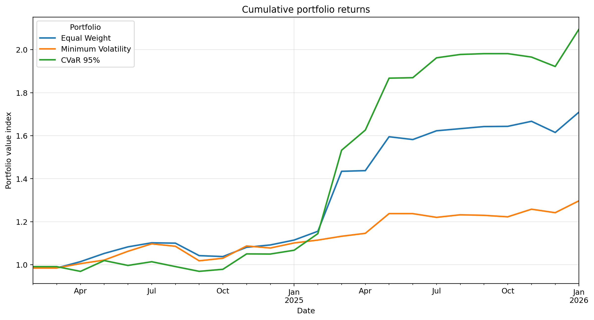
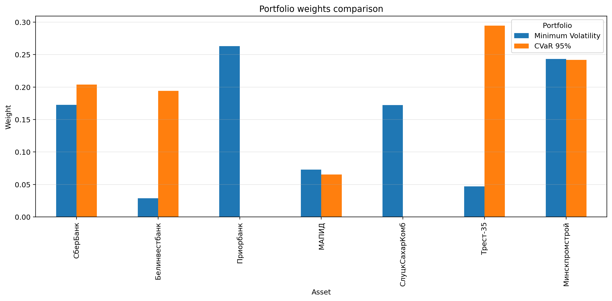

# Аналитика рыночного риска для малоликвидного рынка акций

[English version](README.md)

## Обзор

Репозиторий содержит воспроизводимый пайплайн анализа рыночного риска для белорусских акций. Он оформлен как три связанных кейса:

1. **Кластеризация инвестиционной вселенной** — сокращение набора активов через группировку бумаг со схожей динамикой доходностей.
2. **CVaR-оптимизация портфеля** — построение и сравнение long-only портфелей с акцентом на хвостовой риск / Expected Shortfall.
3. **Макроэкономическое стресс-тестирование** — оценка чувствительности портфелей к инфляции, валютному фактору, ставке рефинансирования и промышленному производству.

Репозиторий подготовлен как портфолио для позиций Data Analyst, Risk Analyst и Market Risk Analyst в финансовом секторе и финтехе.

## Бизнес-задача

На малоликвидном рынке акций часто встречаются короткие ряды, нерегулярные сделки и активы с похожим поведением. Аналитику риска нужно:

- сократить избыточную инвестиционную вселенную перед построением портфеля;
- сравнить базовые и оптимизированные портфели через понятные риск-метрики;
- показать, что устойчивость по хвостовым потерям и устойчивость к макрофакторам — разные измерения риска.

## Структура

```text
equity-risk-analytics-belarus/
├── 01_clustering/
├── 02_cvar_portfolio/
├── 03_factor_stress_testing/
├── docs/
├── requirements.txt
├── .gitignore
├── README.md
└── README.ru.md
```

## Кейсы

### 01. Кластеризация активов

**Цель:** сгруппировать акции по схожести месячных простых доходностей и выбрать по одному представителю из каждого кластера.

**Методы:** monthly simple returns, расстояние `1 - |corr|`, иерархическая кластеризация, выбор представителя по максимальной годовой доходности внутри кластера.

### 02. CVaR-оптимизация портфеля

**Цель:** построить защитный long-only портфель через минимизацию исторического CVaR / Expected Shortfall на уровне 95%.

**Важно:** модуль больше не повторяет кластеризацию. Он получает заранее выбранные 7 активов и занимается только портфельной оптимизацией и анализом хвостового риска.

### 03. Макроэкономический факторный стресс-тест

**Цель:** оценить чувствительность портфелей к макроэкономическим факторам и рассчитать стресс-сценарий.

**Методы:** множественная линейная регрессия, VIF, робастные p-value, интерпретация факторных β и декомпозиция стресс-сценария.

## Технологии

Python, pandas, NumPy, SciPy, statsmodels, matplotlib, seaborn, pytest.

## Как запустить

Из корня репозитория:

```bash
pip install -r requirements.txt
```

Дальше запустить каждый модуль отдельно:

```bash
cd 01_clustering
python run_clustering.py

cd ../02_cvar_portfolio
python run_cvar_portfolio.py

cd ../03_factor_stress_testing
python run_factor_analysis.py
```

Результаты сохраняются в папках `outputs/` внутри каждого модуля.

## Результаты

### Кумулятивная доходность портфеля CVaR


### Сравнение весов портфеля


## Ограничения

Проект является аналитическим кейсом и не является инвестиционной рекомендацией. Подробнее: [`docs/limitations.md`](docs/limitations.md).
